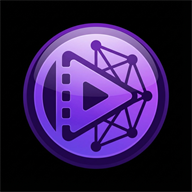

# Vidora Streaming APP

Look, we all know mobile browsers are a nightmare for streaming. That's why I built Vidora Streaming. It is a premium, native Android experience for the Vidora ecosystem. No fluff, no clunky tabs—just you and your content.

## What's the Deal?
This app isn't just a basic WebView wrapper. I've spent time fine-tuning the navigation logic to make sure the "Watch Now" button actually works. It deep-links directly into the Vidora player, bypassing all the landing page nonsense.

## IMPORTANT: Read This Before Installing

> [!WARNING]
> **Network and Provider Issues**
> This app relies on third-party streaming providers. Expect the following:
> - **Anime servers are unstable**: Many anime titles may fail to load or buffer poorly. This is a provider issue, not an app bug.
> - **Regional blocks**: If your ISP or government blocks Vidora providers, you will see "Source Not Found" errors. Use a VPN.
> - **Provider downtime**: Streaming sources go offline without warning. Try again later or pick a different title.

> [!CAUTION]
> **Known Glitches and Limitations**
> No software is perfect. Here is what you might encounter:
> - **UI Flickering**: Brief flashes of system bars when entering/exiting full-screen mode. This is how Android handles window transitions.
> - **WebView Hangs**: If a provider serves broken code or heavy ads, the player might freeze for a few seconds. Use the back button to exit.
> - **Navigation Loops**: Aggressive website redirects might try to hijack the player. The physical back button will always return you to the app.
> - **Screen Wake Issues**: On some devices, the screen might dim during playback. This is a known Android WebView limitation.
> - **Playback Stalling**: Streams may buffer indefinitely or stall mid-playback due to unstable provider servers. This is NOT a network issue on your end—it is the streaming source failing. Close and reopen the player to retry.
> - **Stream Restart from 0:00**: Some providers do not preserve playback position. If you exit and return to a video, it may restart from the beginning instead of resuming where you left off. This is a provider limitation, not an app bug.

> [!NOTE]
> **Device Requirements**
> - **Minimum OS**: Android 7.0 (Nougat) and up (API 24+)
> - **Recommended**: Modern mid-to-high-end devices for smooth 1080p+ playback
> - **Architecture**: Supports arm64-v8a, armeabi-v7a, x86, and x86_64

## Why this app slaps
- **Material 3 Excellence**: Built with Jetpack Compose. It looks and feels like a professional subscription app, but it is free.
- **Smart Navigation**: TV shows automatically default to Season 1, Episode 1 if you are lazy.
- **Ad-Light Experience**: Integrated basic ad-blocking into the player view to keep the experience as clean as possible.
- **Immersive Playback**: Status and gesture bars are automatically hidden during video playback for a true full-screen experience.
- **PiP Mode**: Minimizable player so you can pretend to be productive while watching your shows.

## How to use it
1. Grab the latest APK from the Releases section.
2. Sideload it (enable "Install from Unknown Sources").
3. Search for a show. 
4. Hit "Watch Now".
5. Profit.

---
*Built by a human, for humans. Stay Goated.*
